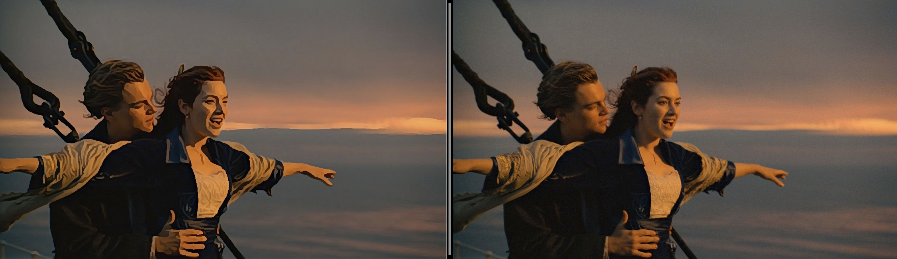
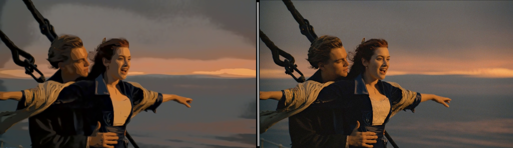

# Artist

The goal of the project is to create artistic images of your pictures and make this available at your fingertip on your phone !. The project uses image abstraction techniques which are discussed :

- [Image Abstraction by Structure Adaptive Filtering](https://www.kyprianidis.com/p/tpcg2008/)  by by Jan Eric Kyprianidis and Jürgen Döllner
- [Image and Video Abstraction by Coherence-Enhancing Filtering](https://www.kyprianidis.com/p/eg2011/jkyprian-eg2011.pdf) by Jan Eric Kyprianidis and  Henry Kang
- [Real-time video abstraction](https://www.researchgate.net/publication/220184181_Real-time_video_abstraction/link/568c559508ae71d5cd04d615/download) by Holger Winnemoeller

The application is a Web app powered by react. Since web application can allow the user to select images, and access them, the technology is well suited  for this purpose.

The application is now live at : **[https://vittorioaccomazzi.github.io/Artist](https://vittorioaccomazzi.github.io/Artist)**

## Sample Images
Click on the immages to magnify them.

## Performances 
Currently the code is not optimized for speed. This is because we still need to identify the algorithm which performs best, and so we are still in an experimentation phase.  Eventually the algorithm shall be implemented in [WebGL](https://webglfundamentals.org/webgl/lessons/webgl-shaders-and-glsl.html) and not in Javascript.  To alleviate the incovenience the processing is done in the background using [web workers](https://developer.mozilla.org/en-US/docs/Web/API/Web_Workers_API/Using_web_workers), see the [appWorker](src/features/appMain/appWorker) folder.
The filtering classes are in the [imglib](src/imglib) folder and they have an extensive regression test. Unfortunately, I was not able to add regression tests of the React component at the same level because jest lack of Canvas and DOMMatrix wrapper which are extensively used in the code.
